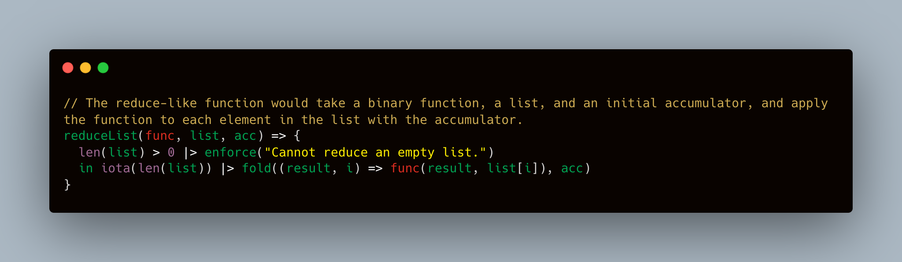

# Investigating the programming abilities of ChatGPT with an abitrary DSL

## Large language models, domain-specific languages, and ChatGPT

[NB: this repo is a follow-up to the same inference task evaluating [ChatGPT](https://github.com/mccaffary/ChatGPT-Domain-Specific-Language/tree/main).]

Large language models (LLMs) such as [GPT-4](https://openai.com/product/gpt-4), [ChatGPT](https://openai.com/blog/chatgpt/), and [Claude](https://scale.com/blog/chatgpt-vs-claude) have demonstrated impressive programming abilities, and are capable of [solving problems](https://github.com/mccaffary/GPT-4-ChatGPT-Project-Euler) across a wide range of languages and their [taxonomies](https://github.com/mccaffary/ChatGPT-Domain-Specific-Language/blob/main/images/programming_language_expressiveness.png). Despite these successes, some scepticism persists over the extent to which these models exhibit any underlying appreciation of the syntactic and operational rules underlying these languages (*versus* memorisation of patterns from training data).

In this prompt-engineering repository, the programming abilities of GPT-4 are explored using an arbitrary domain-specific language (DSL). DSLs represent an attractive substrate for studying the inference capabilities of LLMs because they are novel and less likely to have been extensively encountered and memorised during training[^1]. As such, they enable a more direct test of the extent to which LLMs can infer the rules of novel programming languages in a [*few-shot manner*](https://arxiv.org/abs/2005.14165).

Here, the domain-specific language SIL (Symmetry Integration Language) was selected for two reasons. Firstly, it is extremely unlikely that GPT-4 has been exposed to any significant volume of SIL code during training, as it is an in-house DSL developed by a tech-heavy hedge fund called Symmetry Investments. Secondly, as a programming language, it has some interesting features for the model to reproduce (e.g. it is a functional language which emphasises expressiveness, but lacks `let` expressions as in Haskell or OCaml).

  

> After some example code prompts, GPT-4 attempts to write code in a novel, functional DSL known as 'SIL'.

[^1]: There is [evidence](https://arxiv.org/abs/2202.07646) that LLM memorisation is promoted by the frequency of training example presentation and the number of relevant tokens used to prompt the model.

## Prompt-engineering

Below is a collection of some prompts consisting of short examples of SIL code which highlight its functionality. After prompting GPT-4 with the task and providing SIL code samples (see below; the full library of [prompts](https://github.com/mccaffary/GPT-4-Domain-Specific-Language/tree/main/src/SIL-code/prompt-example) and [generated code samples](https://github.com/mccaffary/GPT-4-Domain-Specific-Language/tree/main/src/SIL-code/generated-SIL-code) can also be found in this repo), I asked it to implement a number of mainstream programing tasks in SIL.

In the sections below, I show some of the example SIL code scripts with which the model was prompted (the full set of examples can be found [here](https://github.com/mccaffary/ChatGPT-Domain-Specific-Language/tree/main/prompt_library)) and its attempts to implement various problems in SIL.

<details>
<summary>Prompt 1 (example SIL code)</summary>
<br>

The first prompt is a script to handle some mail server functionality. As such, it differs greatly from the type of problem I will subsequently prompt ChatGPT to solve, but it does illustrate some of the syntax, data structures, and functional aspects of SIL (e.g. `|>`).

```d
// example of using IMAP IDLE to run rules on new mail
import imap
moveMessages(session,ids,target) => if (ids.length > 0) then imap.moveUIDs(session,ids,target) else false
login = imap.ImapLogin(environment("IMAP_USER"),environment("IMAP_PASS"))
server = imap.ImapServer("imap.fastmail.com","993")
session = imap.Session(server,login,true,imap.Options(debugMode:true)) |> imap.openConnection |> imap.login

rules=[ [
	["INBOX/0receipts",
	[
		"FROM OnlineServices@welcome.aexp.com",
		"FROM interactivebrokers.com",
	]],
	["Junk",
	[
		"FROM Tapatalk",
	]],
	["INBOX/newsletters",
	[
		"FROM news@pitchbook.com",
		"HEADER X-mailer mailgun",
		"HEADER X-mailer WPMailSMTP/Mailer/mailgun 2.4.0",
		"HEADER X-mailer nlserver",
		"FROM hbr.org",
		"FROM elliottwave.com",
		"OR FROM cio.com FROM cio.co.uk",
		"FROM substack.com",
		"FROM eaglealpha.com",
		"FROM haaretz.com",
		"FROM gavekal.com",
		"FROM go.weka.io",
		"FROM marketing.weka.io",
		`HEADER list-unsubscribe ""`,
		`HEADER list-Id ""`,
		`HEADER list-Post ""`,
		`HEADER list-owner""`,
		`HEADER Precedence bulk`,
		`HEADER Precedence list`,
		`HEADER list-bounces ""`,
		`HEADER list-help ""`,
		`HEADER List-Unsubscribe ""`,
		"FROM no-reply",
	]],
	["INBOX/notifications",
	[
		`KEYWORD "$IsNotification"`,
		"FROM feedback@slack.com",
		"FROM donotreply@myhermes.co.uk",
		"FROM skillcast.com",
		"FROM reedmac.co.uk",
		"FROM noreply@uber.com",
		"FROM uber@uber.com",
		"FROM do-not-reply@trello.com",
	]],
]

runRules(Session,Rules) => Rules
	|> map(target => [target[0],(target[1] |>map(term => imap.search(Session,term).ids))])
	|> mapa(set => moveMessages(Session,set[1] |> join,set[0]))

runRulesBox(Session,Rules,Mailbox) => {
	imap.select(Session,Mailbox)
	in runRules(Session,Rules)
}

inboxes=[ "INBOX"]
result = inboxes |> mapa(inbox => runRulesBox(session,rules,imap.Mailbox(session,inbox)))
print(result)
import parallel;
threadFunction(x) => {
	imap.idle(session)
	in inboxes |> mapa(inbox => runRulesBox(session,rules,imap.Mailbox(session,inbox)))
}
parallel.runEvents((x)=>false,[threadFunction])
```
  
</details>

<details>
<summary>Prompt 2 (example SIL code)</summary>
<br>

The second example code prompt similarly aims to highlight some features of this DSL for the model, and introduces some new standard library functions such as `iota` and `fold`.

```d
import imap
import imap_config
import string

// Get the configuration from the environment and command line.
config = imap_config.getConfig(commandLineArguments)

// -------------------------------------------------------------------------------------------------
// Some helper functions.
//
// Firstly, a function to join an array of strings.

joinFields(flds, sep) => {
  len(flds) > 0 |> enforce("Cannot join an empty array.")
  in fold(flds[1:$], (str, fld) => str ~ sep ~ fld, flds[0])
}

// Secondly, a field formatter which strips the field prefix and pads to a fixed width.
// E.g., ("From: me@here.com" |> fmtField(20)) == "me@here.com         "

fmtField(field, width) => {
  pad(str) => iota(width - len(str)) |> fold((a, i) => a ~ " ", str)
  in field
    |> string.split(": ")[1:$]
    |> joinFields(": ")
    |> pad
}

// And thirdly, a function which concatenates the headers into a formatted string.

fmtHeaders(outStr, headers) => {
  outStr ~ "  " ~ joinFields(headers, " | ") ~ "\n"
}

// -------------------------------------------------------------------------------------------------

// Connect to the inbox.
creds = imap.ImapLogin(config.user, config.pass)
server = imap.ImapServer(config.host, config.port)
session =
  imap.Session(server, creds)
  |> imap.openConnection()
  |> imap.login()
inbox = imap.Mailbox(session, "INBOX")

// Get the number of messages in the inbox.
msgCount = imap.status(session, inbox).messages

// Select the default inbox.
inbox |> imap.examine(session, _)

// Get the headers (date, from and subject) for each message, from oldest to newest, format and
// print them.
headers =
  iota(msgCount)
    |> map(id => "#" ~ toString(id + 1))
    |> map(id =>
         imap.fetchFields(session, id, "date from subject").lines
           |> map(hdr => fmtField(hdr, 40)))
    |> fold(fmtHeaders, "INBOX:\n")
print(headers)
```
  
</details>

<details>
<summary>Prompt 3 (example SIL code)</summary>
<br>

The third code sample further illustrates some of the unusual features of this DSL, with the aim that ChatGPT will use these in its own implementations next.

```d
// This script will create a report based on a specific example set of automated 'support' emails.
// E.g.,
//
// "support.mbox": 17 messages 17 new
//  N  1 robot@example.com     Mon May 11 22:26  28/1369  "Alert: new issue 123"
//  N  2 robot@example.com     Tue May 12 12:20  22/933   "Notification: service change"
//  N  3 robot@example.com     Tue May 12 12:36  26/1341  "Alert: new issue 124"
//  N  4 robot@example.com     Wed May 13 02:13  21/921   "Resolution: issue 124"
//  N  5 person@example.com    Wed May 13 18:53  26/1332  "Email not from robot."
//  N  6 robot@example.com     Thu May 14 03:13  27/1339  "Alert: new issue 125"
//  N  7 robot@example.com     Thu May 14 08:46  26/1270  "Resolution: issue 123"
//  N  8 robot@example.com     Thu May 14 17:06  25/1249  "Alert: new issue 126"
//  N  9 robot@example.com     Fri May 15 09:46  24/1185  "Resolution: issue 126"
//  N 10 robot@example.com     Fri May 15 12:33  23/1052  "Alert: new issue 127"
//  N 11 robot@example.com     Fri May 15 15:20  27/1331  "Notification: service change"
//  N 12 robot@example.com     Fri May 15 18:06  23/953   "Resolution: issue 127"
//  N 13 robot@example.com     Mon May 18 12:46  27/1218  "Alert: new issue 128"
//  N 14 robot@example.com     Mon May 18 15:33  32/1628  "Alert: new issue 129"
//  N 15 robot@example.com     Tue May 19 05:26  25/1176  "Resolution: issue 128"
//  N 16 robot@example.com     Tue May 19 08:13  26/1312  "Notification: service change"
//  N 17 robot@example.com     Tue May 19 11:00  28/1275  "Alert: new issue 130"
//
//
// Each of these automated emails are from `robot` _except_ for message 5.  Messages 2, 8 and 16 are
// from `robot` but are unrelated to issues.
//
// This script will search for emails and match new issue numbers with resolutions to report the
// number of outstanding alerts.

import imap
import * from imap.query
import imap_config

import dates
import string

// Get the configuration from the environment and command line.
config = imap_config.getConfig(commandLineArguments)

// Connect to the inbox.
creds = imap.ImapLogin(config.user, config.pass)
server = imap.ImapServer(config.host, config.port)
session =
  imap.Session(server, creds)
    |> imap.openConnection()
    |> imap.login()
inbox = imap.Mailbox(session, "support")

// Select the default inbox.
inbox |> imap.examine(session, _)

// These criteria are common for both our searches.
commonCrit = imap.Query()
    |> and(from(`robot@example.com`))
    |> and(sentSince(dates.Date(2020, 5, 13)))

// Get each of the alerts and resolutions from the past week (13-19 May 2020).
alertMsgIds =
  imap.search(session, imap.Query(subject("Alert: new issue")) |> and(commonCrit)).ids
resolutionMsgIds =
  imap.search(session, imap.Query(subject("Resolution: issue")) |> and(commonCrit)).ids

// A function to get the alert ID from a message subject.
getAlertId(msgId) => {
  imap.fetchFields(session, toString(msgId), "subject").lines[0]
    |> string.split()[$ - 1]
}

// A function to remove an entry from a table whether it's there or not.
removeIfExists(tbl, key) => {
  if find(keys(tbl), key) == [] then
    tbl
  else
    removeEntry(tbl, key)
}

// Now find those alerts which have no resolution.  Firstly the subject for each alert, get the
// issue number end and store it in a table.
allAlertTable = alertMsgIds |> fold((tbl, msgId) => addEntry(tbl, getAlertId(msgId), msgId), {})

// Go through the resolutions and remove their corresponding alerts from the table.
unresolvedAlertTable =
  resolutionMsgIds |> fold((tbl, msgId) => removeIfExists(tbl, getAlertId(msgId)), allAlertTable)

// Create a report with the date of the unresolved alerts.
report =
  keys(unresolvedAlertTable)
    |> map(alertId => {
         msgId = unresolvedAlertTable[alertId] |> toString
       in [ alertId
          , imap.fetchFields(session, msgId, "date").lines[0]
          , imap.fetchText(session, msgId).lines[0]
          ]
       })
    |> fold((outStr, tuple) => {
         outStr ~ "Issue: " ~ tuple[0] ~ "\n  " ~ tuple[1] ~ "\n  Summary: " ~ tuple[2] ~ "\n"
       }, "\nUNRESOLVED ISSUES FROM THE PAST 10 DAYS:\n\n")

// Close the session.
imap.closeConnection(session)

// Print the report last.
print(report)
```
  
</details>

<details>
<summary>Prompt task 1: Implement a simple relational database</summary>
<br>
  
As a first exercise, I asked the model to implement a very simple relational database in SIL, with basic functionalities (note that `//` denotes commenting in SIL).

```d
import imap
import imap_config
import string

// Get the configuration from the environment and command line.
config = imap_config.getConfig(commandLineArguments)

// Connect to the server.
creds = imap.ImapLogin(config.user, config.pass)
server = imap.ImapServer(config.host, config.port)
session =
  imap.Session(server, creds)
  |> imap.openConnection()
  |> imap.login()

// -------------------------------------------------------------------------------------------------
// Here's an attempt to create something resembling a simple relational database.

// Define two tables, 'Employees' and 'Departments'.
Employees = { "1": ["Alice", "Engineering"], "2": ["Bob", "Marketing"], "3": ["Charlie", "Engineering"] }
Departments = { "Engineering": ["Alice", "Charlie"], "Marketing": ["Bob"] }

// Function to emulate SQL SELECT operation.
select = (table, id) => {
    table[id] |> enforce("Id does not exist in table.")
}

// Function to emulate SQL INSERT operation.
insert = (table, id, values) => {
    addEntry(table, id, values)
}

// Function to emulate SQL DELETE operation.
delete = (table, id) => {
    removeEntry(table, id)
}

// Function to emulate SQL JOIN operation.
join = (table1, table2, commonField) => {
    // This is a very basic JOIN operation and does not account for multiple matches, etc.
    joinedTable = {}
    for key in keys(table1) {
        value = table1[key][commonField]
        if find(keys(table2), value) != [] {
            joinedTable = addEntry(joinedTable, key, [table1[key], table2[value]])
        }
    }
    joinedTable
}

// Close the session.
imap.closeConnection(session)

// Perform operations.
newEmployee = ["David", "Marketing"]
Employees = insert(Employees, "4", newEmployee)
Departments = insert(Departments, newEmployee[1], ["David"])
print(select(Employees, "1"))
print(join(Employees, Departments, 1))
```
  
</details>

<details>
<summary>Prompt task 2: Implement bubblesort</summary>
<br>

Implementing sorting algorithms is an archetypal software engineering interview question. Here, I asked GPT-4 to implement [bubblesort](https://en.wikipedia.org/wiki/Bubble_sort) (conceptually the most basic sorting algorithm) in SIL. Below is the response:

```d
// Helper function to bubble up the largest value in one pass
bubble(list) => {
  if length(list) <= 1 then
    list
  else
    if list[0] > list[1] then
      [list[1]] ~ bubble([list[0]] ~ list[2 to $])
    else
      [list[0]] ~ bubble(list[1 to $])
}

// Main BubbleSort function
bubbleSort(list) => {
  bubbled = bubble(list)
  if bubbled == list then
    list
  else
    bubbleSort(bubbled)
}
```
  
</details>

<details>
<summary>Prompt task 3: Implement a function to compute the median of an array/list</summary>
<br>

Next, I prompted the model to write a script for computing the median of a list (generated response below). The helper function `sortList` is, indeed, consistent with functional programming paradigms, but here GPT-4 assumes the existence of the assignment operator `:=`.

```d
// Helper function to sort an array of integers.
sortList(list) => list |> len |> iota |> map(i => list |> min |> snd) |> each((i, minVal) => list := removeIndex(list, minVal))

// Function to compute the median of a set of integers.
computeMedian(list) => {
  // Sort the list in ascending order.
  sortedList = sortList(list)
  
  // Get the length of the list.
  length = len(sortedList)

  // Check if the length is even.
  isEven = length % 2 == 0

  // If the length is even, the median is the average of the two middle numbers.
  // Otherwise, the median is just the middle number.
  median = 
    if isEven then 
      (sortedList[length / 2 - 1] + sortedList[length / 2]) / 2 
    else 
      sortedList[length / 2]
  
  // Return the median.
  median
}
```
  
</details>

<details>
<summary>Prompt task 4: Implement the k-nearest neighbours algorithm</summary>
<br>
  
GPT-4 was next prompted to implement the *k*-nearest neighbours algorithm in SIL. Aside from hallucinating/assuming the existence of a module called `math` (which, arguably, is a reasonable assumption for the scope of this exercise), this seems like an acceptable solution, which appropriately leverages functional operators such as `|>`, `map`, and `fold`.

```d
import math

distance(p1, p2) => {
  math.sqrt(
    math.pow(p1[0] - p2[0], 2)
    + math.pow(p1[1] - p2[1], 2)
  )
}

majorityVote(labels) => {
  labelCounts = labels |> fold((counts, label) => addEntry(counts, label, get(counts, label, 0) + 1), {})
  labelCounts |> maxBy((_, count) => count)
}

knn(data, newPoint, k) => {
  distances = data |> map((point, label) => (distance(point, newPoint), label))
  sorted = distances |> sort((a, b) => a[0] < b[0])
  nearest = sorted |> take(k)
  labels = nearest |> map((_, label) => label)
  majorityVote(labels)
}

```
  
</details>
	

<details>
<summary>Prompt task 5: Implement functional operators</summary>
<br>

One of the interesting features of functional languages is that they can be highly expressive. Here, I prompted GPT-4 to implement the basic functional operators `map`, `filter`, and `reduce` (or `fold` in the context of functional languages).
	
```d
// map

// The map-like function would take a function and a list, and apply the function to each element in the list.
mapList(func, list) => {
  len(list) > 0 |> enforce("Cannot map over an empty list.")
  in iota(len(list)) |> fold((result, i) => addEntry(result, func(list[i])), [])
}

// filter

// The filter-like function would take a predicate and a list, and return a list of elements for which the predicate returns true.
filterList(pred, list) => {
  len(list) > 0 |> enforce("Cannot filter an empty list.")
  in iota(len(list)) |> fold((result, i) => if pred(list[i]) then addEntry(result, list[i]) else result, [])
}

// reduce

// The reduce-like function would take a binary function, a list, and an initial accumulator, and apply the function to each element in the list with the accumulator.
reduceList(func, list, acc) => {
  len(list) > 0 |> enforce("Cannot reduce an empty list.")
  in iota(len(list)) |> fold((result, i) => func(result, list[i]), acc)
}

```
  
</details>

<details>
<summary>Prompt task 6: Solving Project Euler problems in SIL</summary>
<br>

[Project Euler](https://projecteuler.net/) is a collection of mathematical and programming problems (which I think make [interesting prompts](https://github.com/mccaffary/ChatGPT-Project-Euler) for LLMs). Here, I prompt GPT-4 to solve the first two Project Euler problems using SIL.

```d
// Project Euler problem #1:
// Here, my prompt was to solve the (easy) first problem of the Project Euler series (https://projecteuler.net/problem=1)

// Define a range from 1 to 999.
range = iota(999) |> map(x => x + 1)

// Define a function to check if a number is a multiple of 3 or 5.
isMultipleOf3Or5 = (num) => num % 3 == 0 || num % 5 == 0

// Filter the range to get only multiples of 3 or 5.
multiples = range |> filter(isMultipleOf3Or5)

// Sum the multiples.
sum = multiples |> fold((a, b) => a + b, 0)

// Print the sum.
print(sum)

```

```d
// Project Euler problem #2:
// This prompt is to solve the second Project Euler problem (https://projecteuler.net/problem=2)

// Define a function to generate the next term in the Fibonacci sequence.
nextFibonacciTerm = (tuple) => [tuple[1], tuple[0] + tuple[1]]

// Start with the first two terms.
initialTerms = [1, 2]

// Define a function to generate Fibonacci sequence up to a limit.
generateFibonacci = (limit) => {
  fibonacciSequence = unfold(nextFibonacciTerm, initialTerms, (tuple) => tuple[1] <= limit)
  fibonacciSequence
}

// Define a function to check if a number is even.
isEven = (num) => num % 2 == 0

// Generate the Fibonacci sequence up to four million.
fibonacciSequence = generateFibonacci(4000000)

// Extract the second term from each tuple in the sequence, which is the actual Fibonacci number.
fibonacciNumbers = fibonacciSequence |> map(tuple => tuple[1])

// Filter the sequence to get only even numbers.
evenFibonacciNumbers = fibonacciNumbers |> filter(isEven)

// Sum the even numbers.
sum = evenFibonacciNumbers |> fold((a, b) => a + b, 0)

// Print the sum.
print(sum)

```
  
</details>

## High-level summary

Exploring the ability of LLMs to infer and understand the features of a novel programming language in a *few-shot* manner remains an open and interesting question. Here, these capacities were explored in the context of prompting GPT-4 to solve prompted problems in a novel domain-specific language (DSL) called SIL. DSLs are a potentially useful test case for exploring *inference* vs *memorisation* in LLMs, as they often have distinctive features and are less likely to have been extensively encountered during training (if at all).
  
Perhaps the most interesting finding of this exercise is that the few-shot inference capabilities of GPT-4 are *significantly* better than those of ChatGPT when evaluated on the same prompts and tasks (see analogous exercise with ChatGPT [here](https://github.com/mccaffary/ChatGPT-Domain-Specific-Language/tree/main)).
  
